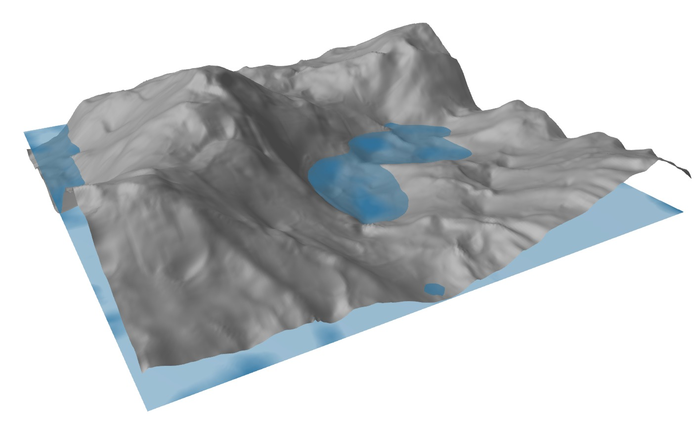
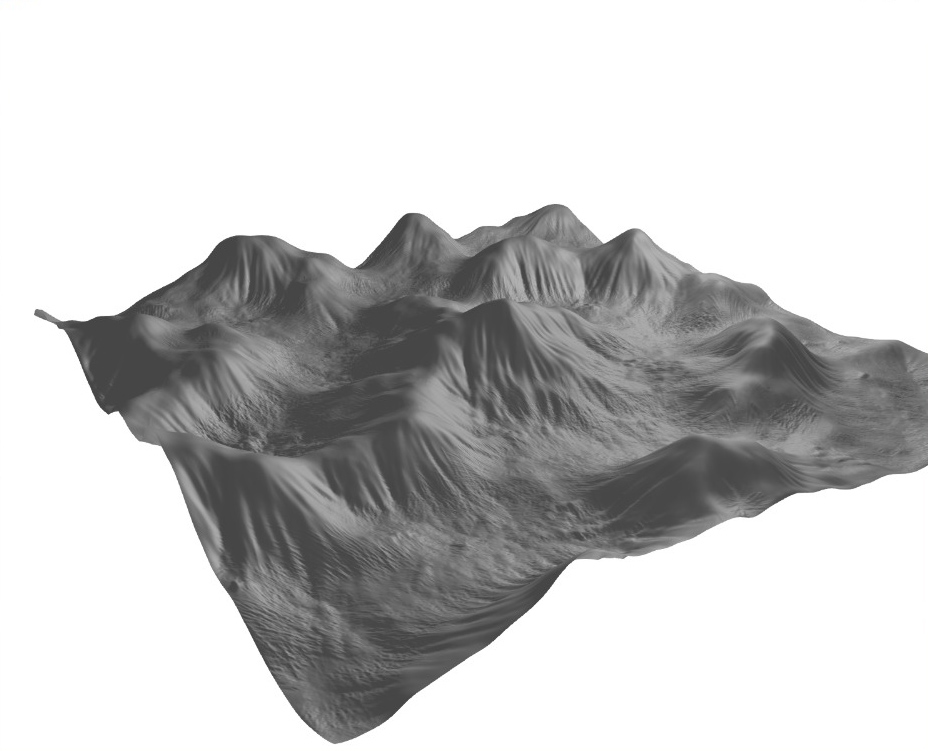

# Erosion

Simulations of erosion / sediment flow in Julia using 2 methods:

- Flowfield.jl - Vector fields based on local gradients
- ParticleSinglestep.jl - Sequential single particle trajectories

## How it works

1. Base terrain is generated using simplex noise to make a heightmap
2. Precipitation is randomly generated
3. The heightmap is modified iteratively using one of the algorithms
4. A 3d mesh is generated and an image is rendered using Makie

## Examples

Field method:

Particle method:

